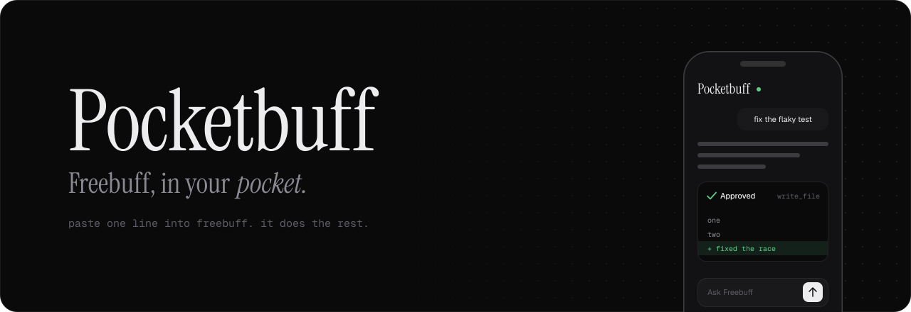

<p align="center">
  <picture>
    <source media="(prefers-color-scheme: light)" srcset="docs/banner-light.svg">
    
  </picture>
</p>

<p align="center">
  Drive Freebuff on your computer from your phone.<br>
  Chat, approve edits, read diffs, pick up terminal chats. Private over your own Tailscale network, and free.
</p>

<p align="center">
  <a href="#install">install</a> &nbsp;·&nbsp;
  <a href="#how-it-works">how it works</a> &nbsp;·&nbsp;
  <a href="site/install.md">install.md</a> &nbsp;·&nbsp;
  <a href="#deploy-the-site">deploy the site</a>
</p>

<br>

## install

Paste this into Freebuff on the computer you want to control:

```
Read https://<your-site>/install.md and follow it
```

Freebuff does the setup. You sign in to Tailscale once, then open the link it gives you on your phone. Prefer a terminal?

```sh
curl -fsSL https://<your-site>/install.sh | bash -s -- --yes
```

Later: `bash ~/.pocketbuff/install.sh doctor`, `pair` for a new phone code, `uninstall` to remove everything.

## what you get

- **chat** with Freebuff from your phone, streamed as it types
- **approve or deny** file writes and commands before they run, with the diff in view
- **terminal chats**: open a `freebuff` CLI chat on your phone and keep going, then `freebuff --continue` back at the desk
- **sessions** per project, each with its own history, cancel and approvals
- **installable** as an app: Share, then Add to Home Screen
- **private**: only devices on your tailnet can reach it, and pairing uses a one-time 6-digit code
- **free**: it uses your existing Freebuff login, no API key

## how it works

```text
phone (PWA)
   │  https, tailnet only
   ▼
tailscale serve ──► 127.0.0.1:8787  pocketbuff companion
                                     sessions · approvals · pairing
                                        │
                                        ▼
                                     @codebuff/sdk, free mode
                                     your Freebuff login + slot
```

The companion binds to localhost and is never exposed to the public internet. The phone talks to it over a WebSocket that needs the token handed out at pairing.

## commands

```sh
npm install        # also patches the sdk for free mode
npm run dev        # server with reload
npm run build      # client build + type check
npm test           # 40 tests, builds the client first if needed
npm run check      # build + tests
```

Run it by hand without the installer:

```sh
export FREEBUFF_REMOTE_TOKEN="$(openssl rand -hex 24)"
export FREEBUFF_PROJECT_DIR=/absolute/path/to/project
npm start          # then open http://127.0.0.1:8787/#token=$FREEBUFF_REMOTE_TOKEN
```

To reach it from your phone, put it on your tailnet (it stays bound to localhost):

```sh
tailscale serve --bg http://127.0.0.1:8787
tailscale serve status   # open the https url it prints on your phone
```

`FREEBUFF_REMOTE_MOCK=1 npm start` runs a mock agent that never contacts Freebuff.

## deploy the site

`site/` is the whole website: landing page, `install.md`, `install.sh`. `.github/workflows/deploy-site.yml` deploys it on every push to `main` that touches `site/**`, or by hand from the Actions tab (Vercel Production Deployment, then Run workflow).

Why this route: Vercel's free Hobby plan doesn't let several people deploy to one project (collaborators are a paid Team feature). A token plus GitHub Actions lets any push to `main` deploy without anyone joining a Vercel team.

> Do **not** import or connect this repo in the Vercel dashboard. The Vercel Git integration stays off; GitHub Actions does the deploys.

One-time setup, about 2 minutes:

1. **token**: create one at https://vercel.com/account/tokens
2. **login**: `npm i -g vercel`, then `vercel login`
3. **link**: `cd site && vercel project add pocketbuff && vercel link --yes --project pocketbuff && cd ..` (skip `project add` if it exists). This writes `site/.vercel/project.json` with `orgId` and `projectId`. It is git-ignored.
4. **secrets**:
   ```sh
   gh secret set VERCEL_TOKEN --repo SIDDHANTCOOKIE/PocketBuff        # paste the token when asked
   gh secret set VERCEL_ORG_ID --repo SIDDHANTCOOKIE/PocketBuff --body "$(jq -r .orgId site/.vercel/project.json)"
   gh secret set VERCEL_PROJECT_ID --repo SIDDHANTCOOKIE/PocketBuff --body "$(jq -r .projectId site/.vercel/project.json)"
   ```
5. **deploy**: push to `main`, or run the workflow once by hand

Without Actions: `bash scripts/deploy-site.sh` links on the first run, then runs `vercel deploy --prod`. It uses `VERCEL_TOKEN` when set, otherwise your `vercel login` session.

## freebuff free mode

The companion runs on your existing Freebuff login (`~/.config/manicode/credentials.json`) with no paid key. Free mode has three requirements, and the companion handles all of them:

- **Agent and model.** Free mode only admits the CLI's own root agent for the admitted model (the current CLI uses `base3-free-*` roots, for example `base3-free-glm-5-3-flash`). `freebuff-agents.json` holds those definitions, keyed by model and copied verbatim from the codebuff repo (Apache-2.0). Regenerate it with `node scripts/extract-freebuff-agent.mjs /path/to/codebuff`.
- **Session slot.** Before the first run, the companion claims a slot (`POST /api/v1/freebuff/session/admission`). It saves the slot in `~/.config/freebuff-remote/slot.json` and releases it when the server stops.
- **Instance id on every call.** `@codebuff/sdk` 0.10.7 can't send `freebuff_instance_id`, so `npm install` runs `scripts/patch-sdk.mjs` to add it. The server refuses to start with an unpatched SDK.

Settings:

- `FREEBUFF_MODEL` (default `z-ai/glm-5.3-flash`, which costs 0 Freebucks). Supported values: `z-ai/glm-5.3-flash`, `mimo/mimo-v2.5`, `upstage/solar-pro4`, `deepseek/deepseek-v4-flash`, `deepseek/deepseek-v4-pro`, `openai/gpt-5.6-luna`.
- `FREEBUFF_ALLOW_FREEBUCKS=1` lets the companion claim a model that costs Freebucks. By default it only claims zero-cost models and tells you which ones are available.

Freebuff gives one slot per account. While the companion holds it, your desktop `freebuff` CLI can't run at the same time, and vice versa. Stop the companion (Ctrl-C) before going back to the terminal; it gives the slot back on exit, even with a phone still connected.

## terminal chats

Tap **Terminal chats** to list the Freebuff CLI chats for the session's project (from `~/.config/manicode/projects/<project folder name>/chats/`, or `FREEBUFF_CONFIG_DIR`). Opening one shows its transcript. Messages you send then continue that chat: the companion loads the CLI's saved `run-state.json` as the previous run, and after each turn it writes `run-state.json`, `chat-messages.json` and `chat-meta.json` back in the CLI's format. **Detach** goes back to the phone's own session.

Back at the desk, run `freebuff --continue <chat id>` (the id is shown in the banner on the phone). The CLI shows the phone's turns and the model remembers them.

Two things are adjusted when loading a CLI run state, because `@codebuff/sdk` 0.10.7 is older than the CLI:

- The CLI saves every bundled agent template in the run state, and the backend rejects them when they're sent back. The companion sends only the root agent; the CLI adds its own again on its next run.
- Newer CLIs store `gitChanges` as a repository summary that the SDK's prompt builder can't read, so it is dropped.

Stop the CLI before continuing a chat on the phone, and stop the companion before `freebuff --continue`: only one of them can hold the Freebuff slot. If the CLI shows "Take over", choosing it restarts the CLI without your `--continue` argument, so run the command again.

## security

- Freebuff's own login token stays on the computer. The phone gets only Pocketbuff's access token, handed out at pairing.
- The server binds to `127.0.0.1`; Tailscale Serve is the only way in.
- Pairing codes are single use, expire after 10 minutes, allow 5 tries, and are stored hashed.
- Approvals gate file writes and commands; anything left open when a run stops is denied.

## roadmap

[ROADMAP.md](ROADMAP.md). Next up: a `pocketbuff` CLI (M7) and a Windows installer.
